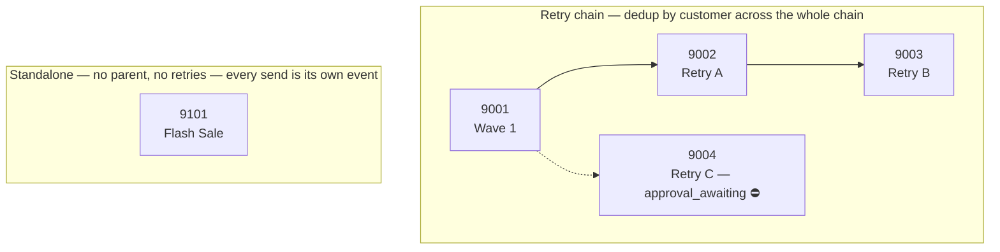

# Comm-Log Send Reconciliation

Reconstructing Finance's `target_base` metric — the true number of customers reached by a merchant's campaigns — from raw send logs, and explaining exactly why a naive query gets it wrong.

**Result: `target_base = 22`** for merchant `501`, October 2026 — reconciled from a raw dataset of 30 send attempts, matching Finance's reported figure.

---

## The Problem

A straightforward `COUNT(*)` over the send log gives **30**. Finance's real number is **22**. The gap isn't a bug — it's business logic that lives across two tables and isn't visible from a single `SELECT`:

- Some campaigns look "sent" but haven't cleared internal approval yet, so their sends don't count.
- Some sends simply failed to deliver.
- Campaigns can be **retried** (a new campaign row pointing back at the original via `parent_id`), and a customer reached anywhere in that retry chain should only be counted once — not once per attempt.
- But a customer *legitimately* re-targeted twice under the same standalone campaign (no retry chain at all) should still count twice.

This repo works through that gap step by step, with every adjustment backed by a query against the data — not asserted from the schema docs alone.

---

## Data Model

Two tables, scoped to `merchant_id = 501`, `communication_type = '2'` (Campaign), October 2026.

**`campaign`** — one row per campaign

| Column | Meaning |
|---|---|
| `id` | Campaign id |
| `parent_id` | If set, this campaign is a retry of `parent_id`. NULL = not a retry (may still have retries pointing at *it*) |
| `creation_status` | `approved` / `aborted` / `resumed` / `stopped` = finalized; `approval_awaiting` = not yet cleared |
| `processing_status` | `processed` = send pipeline has finished |

A campaign counts toward reporting only when **both** its creation workflow is finalized *and* its processing is complete — the send pipeline can run ahead of approval bookkeeping, so `communication_log` rows can exist for a campaign that isn't actually eligible yet.

**`communication_log`** — one row per individual send attempt

| Column | Meaning |
|---|---|
| `communication_id` | FK → `campaign.id` |
| `customer_id` | Customer targeted |
| `delivery_status` | `900` = delivered, `1100` = failed (soft — may be retried) |

A customer can appear more than once under the same `communication_id` — that's a legitimate re-target, distinct from a *retry*, which always creates a new campaign row instead.

### Retry chains vs. standalone campaigns



A retry chain (however many levels deep) represents **one** underlying communication — a customer who failed twice and succeeded on the third attempt was reached once. A standalone campaign has nothing pointing at it and points at nothing — every send under it is independent, so the same customer being messaged twice counts as two events.

---

## Approach & Results

| Step | Adjustment | Running Total | Why |
|:---:|---|:---:|---|
| 0 | Naive baseline | 30 | Raw `COUNT(*)`, scoped only by merchant/type/month |
| 1 | Drop ineligible campaigns | 26 | Campaign 9004 is `approval_awaiting` — its 4 delivered sends don't count yet |
| 2 | Drop failed sends | 22 | 4 remaining attempts have `delivery_status = 1100` — never a "reached" customer |
| 3 | Dedup within retry chains | 22 | Verified empirically — no customer succeeded more than once in the same eligible chain here, so this step is a no-op *in this dataset* (but is what makes the query correct in general) |
| 4 | Preserve standalone repeats | 22 | Customer C20's two successful sends under standalone campaign 9101 both correctly remain |

Full reasoning, evidence per step, and the verification query for Step 3 are in [`reports/submission.md`](reports/submission.md); the discovery narrative is in [`reports/walkthrough.md`](reports/walkthrough.md).

---

## Running It

```bash
sqlite3 data/comm_log.db < sql/final_query.sql
# target_base
# 22
```

Or with pandas, using `data/campaign.csv` / `data/communication_log.csv` directly.

The staged queries in `sql/` (`01_baseline` → `05_standalone_analysis`) mirror the bridge above one adjustment at a time, so each step can be run and checked in isolation before trusting `final_query.sql`, which combines all of them.

---

## Repo Structure

```
data/           campaign.csv, communication_log.csv, comm_log.db
sql/            01_baseline → 05_standalone_analysis, plus final_query.sql
reports/        submission.md (bridge + evidence), walkthrough.md (narrative)
scripts/        validate_reconciliation.py — automated check against 22
```

## Key Engineering Decisions

- **Nothing is hardcoded to this dataset.** Retry-chain roots are resolved with a recursive CTE over `parent_id`, and standalone vs. chained classification falls out of chain size — not a hand-picked list of campaign IDs. Reshaping the retry structure would reclassify correctly without touching the query logic.
- **Claims are verified, not asserted.** Where the bridge says a rule "causes no numerical change here," that's backed by an explicit query checking for the overlap it would have caught (see `reports/submission.md §4`), rather than inferred from eyeballing the data.
