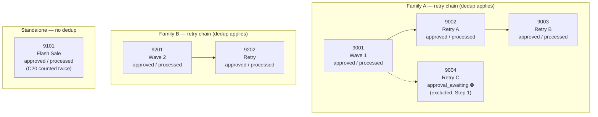

# Comm-Log Send Reconciliation — Submission

**Merchant:** 501  **Period:** October 2026  **Type:** `2` (Campaign)
**Target:** Reproduce Finance's stated `target_base = 22` and explain the gap from a naive count.

---

## 1. Reconciliation Bridge

Starting point: a naive `COUNT(*)` on `communication_log`, scoped only to merchant, type, and month — no notion of campaign eligibility, delivery outcome, or retry structure. Each row below is an adjustment discovered by comparing the running total against the data, in the order it came up.

| Step | Adjustment | Description | Result | Reason & Evidence |
|:---:|---|---|:---:|---|
| 0 | Baseline | Naive scoped raw attempts | **30** | `COUNT(*)` on `communication_log` for `merchant_id = 501`, `communication_type = '2'`, October 2026. No business logic applied yet — this is the upper bound. |
| 1 | Eligibility | Exclude campaigns not yet finalized | **26** | Campaign `9004` has `creation_status = 'approval_awaiting'` — outside the finalized set (`approved`, `aborted`, `resumed`, `stopped`). Its 4 delivered attempts (C11–C14) exist in the log but haven't cleared approval, so they don't count toward reported sends, per the README's eligibility gate. |
| 2 | Delivery outcome | Exclude failed send attempts | **22** | Of the 26 remaining attempts (all from eligible campaigns), 4 have `delivery_status = 1100` (soft failure): C2 and C3 on campaign 9001, C3 on 9002, and D1 on 9201. A failed attempt never represents a "reached" customer, regardless of whether it later succeeds in that same retry chain — so it's dropped before any dedup logic runs. |
| 3 | Retry-chain dedup | Collapse each retry chain to distinct customers | **22** | Grouped remaining eligible+delivered sends by retry-chain root (via `parent_id`) and counted `DISTINCT customer_id` per chain. **Verified empirically** — see [§4](#4-verification-no-hidden-double-counting) — no customer has more than one successful delivery within the same eligible chain in this dataset, so this step is fully implemented but produces a net adjustment of **0** here. |
| 4 | Standalone preservation | Leave non-chained campaigns un-deduplicated | **22** | Campaign 9101 has no parent and no retries pointing at it — it's a standalone communication. Customer C20 was legitimately re-targeted and delivered twice under 9101 (different dates), and both events correctly remain distinct sends, not a dedup target. |
| **Final** | — | **`target_base`** | **22** | Matches Finance's reported number. |

---

## 2. Retry Structure (why steps 3–4 behave differently)



Families A and B each collapse to **one** underlying communication per Finance's definition — every distinct customer reached anywhere in the chain counts once. `9101` has nothing pointing at it and points at nothing, so it's scored as independent events.

---

## 3. SQL Query

The final, runnable query is [`sql/final_query.sql`](../sql/final_query.sql):

```sql
WITH RECURSIVE campaign_tree AS (
    -- Base cases: campaigns with no parent are roots of their own chain
    SELECT id, parent_id, id AS root_id, creation_status, processing_status
    FROM campaign
    WHERE parent_id IS NULL

    UNION ALL

    -- Recursive step: walk down every retry pointing back at a known root
    SELECT c.id, c.parent_id, t.root_id, c.creation_status, c.processing_status
    FROM campaign c
    JOIN campaign_tree t ON c.parent_id = t.id
),
chain_sizes AS (
    -- A chain of size 1 (root, no children) is a standalone campaign
    SELECT root_id, COUNT(*) AS chain_size
    FROM campaign_tree
    GROUP BY root_id
),
campaign_classification AS (
    SELECT t.*,
           CASE WHEN s.chain_size = 1 THEN 1 ELSE 0 END AS is_standalone
    FROM campaign_tree t
    JOIN chain_sizes s ON t.root_id = s.root_id
),
scoped_logs AS (
    SELECT *
    FROM communication_log
    WHERE merchant_id = 501
      AND communication_type = '2'
      AND sent_time >= '2026-10-01'
      AND sent_time <  '2026-11-01'
),
eligible_logs AS (
    -- Eligibility gate (Step 1) + delivered-only filter (Step 2)
    SELECT l.*, c.root_id, c.is_standalone
    FROM scoped_logs l
    JOIN campaign_classification c ON l.communication_id = c.id
    WHERE l.delivery_status = 900
      AND c.creation_status IN ('approved', 'aborted', 'resumed', 'stopped')
      AND c.processing_status = 'processed'
)
SELECT
    SUM(CASE WHEN is_standalone = 1 THEN 1 ELSE 0 END)
    + COUNT(DISTINCT CASE WHEN is_standalone = 0 THEN root_id || '_' || customer_id END)
    AS target_base
FROM eligible_logs;
```

```
$ sqlite3 data/comm_log.db < sql/final_query.sql
target_base
22
```

The eligibility gate and delivered-only filter apply uniformly to every campaign; the split only happens at the very last step, where standalone sends are summed as raw events and chained sends are deduplicated by `(root_id, customer_id)`. Nothing here is hardcoded to the shape of this dataset — reclassifying a chain (e.g. adding a new retry to 9101) would change which branch a row falls into automatically.

---

## 4. Verification: No Hidden Double-Counting

Step 3 claims retry-chain dedup makes no numerical difference in this dataset. Rather than assert that from inspection, it was checked directly — grouping eligible, delivered sends by `(root_id, customer_id)` and looking for any group with more than one row:

```sql
SELECT root_id, customer_id, COUNT(*) AS successful_sends
FROM eligible_logs
WHERE is_standalone = 0
GROUP BY root_id, customer_id
HAVING COUNT(*) > 1;
```

**Result: 0 rows.** Every customer who eventually succeeded within a retry chain (e.g. C2 on 9001→9002, C3 on 9001→9002→9003, D1 on 9201→9202) had failed every prior attempt in that same chain — so distinct-customer counting and raw-row counting happen to agree here. The dedup logic in `final_query.sql` is still load-bearing: it's what makes the query correct in general, not just correct for this dataset. A dataset where a customer succeeded on both attempt 1 and a later retry would diverge from a naive count, and this query would catch it.

---

## 5. Data Observations

A few things stood out while reconciling, independent of whether they moved the final number:

- **Send pipeline can outrun approval bookkeeping.** Campaign 9004's sends were fully delivered before the campaign itself cleared approval — a reminder that `communication_log` existing is not itself proof a campaign counts.
- **Retry ≠ re-send.** The dataset deliberately separates two similar-looking but distinct events: a new `campaign.parent_id` row (a retry — same underlying communication) versus a repeated `customer_id` under one unchanged `communication_id` (a standalone re-target — a new event). Conflating these would either over- or under-count depending on direction.
- **A rule can be "correct" with zero visible effect.** Retry-chain dedup is required by the business definition of `target_base` and is fully implemented, but it doesn't change this particular result — that distinction (semantic correctness vs. numerical impact on this dataset) is exactly why the bridge separates Steps 3 and 4 from Steps 1 and 2 instead of folding everything into one "apply all the rules" step.

---

## Bridge at a Glance

| Step | 0 | 1 | 2 | 3 | 4 |
|---|:---:|:---:|:---:|:---:|:---:|
| Running total | 30 | 26 | 22 | 22 | **22** |
| Δ | — | −4 | −4 | 0 | 0 |
